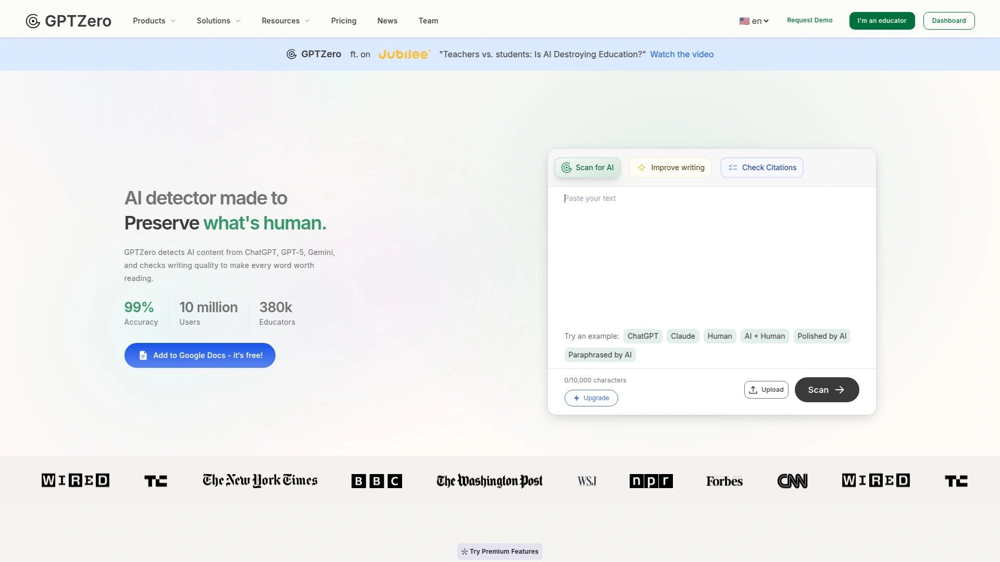

# 18 Top-Tier AI Content Detection Tools You Must Know in 2025

With AI-generated content flooding the internet, distinguishing between human and machine writing has become critical for educators, publishers, and content creators. These AI detection tools analyze text patterns, sentence structures, and writing characteristics to identify AI-generated content with accuracy rates reaching 99%, helping maintain content authenticity and academic integrity across millions of documents daily.

---

## **[Originality.AI](https://originality.ai)**

Advanced AI detection platform combining GPT-4, ChatGPT, and plagiarism checking for comprehensive content verification.

Originality.AI stands out by detecting content from multiple AI models including GPT-3, GPT-3.5, GPT-4, and Bard with industry-leading accuracy. The platform processes text through sophisticated algorithms that analyze writing patterns, vocabulary choices, and structural elements that distinguish AI from human writing. Beyond detection, it includes a full plagiarism checker, readability scoring, and fact-checking capabilities in a single dashboard.

What makes it particularly valuable for publishers and agencies is the team management system allowing multiple users to scan content collaboratively. The Chrome extension enables instant checking while browsing, and the API integration allows bulk scanning of entire websites. Historical scan data helps track content quality over time, while the pay-as-you-go pricing model means you only pay for what you actually scan.

---

## **[GPTZero](https://gptzero.me)**

Education-focused AI detection tool designed specifically for academic integrity and classroom use.

**Academic Excellence Features:**

GPTZero specializes in educational contexts, trained on millions of human-written and AI-generated texts from academic sources. The platform highlights specific sentences likely generated by AI, providing educators with detailed evidence for academic reviews. Their batch upload feature processes multiple student submissions simultaneously, saving hours of manual checking.

The tool excels at detecting mixed content where students combine their own writing with AI assistance. Statistical analysis shows detection confidence levels, helping educators make informed decisions. Integration with Learning Management Systems streamlines the review process, while special education pricing makes it accessible for institutions of all sizes.

---

## **[Copyleaks](https://copyleaks.com)**

Enterprise-grade content authentication platform supporting 30+ languages with military-grade security.

Copyleaks processes content through multiple detection layers, identifying AI-generated text, paraphrased content, and traditional plagiarism simultaneously. Their proprietary technology analyzes semantic meaning rather than just matching text strings, catching sophisticated attempts to disguise AI content. The platform maintains SOC 2 Type II certification, ensuring data security for sensitive corporate and academic documents.

Real-time scanning APIs integrate with content management systems, automatically checking submissions as they arrive. The platform generates detailed similarity reports showing source comparisons and probability scores. White-label options allow organizations to brand the detection interface as their own service.

---

## **[Writer AI Content Detector](https://writer.com)**

Free, unlimited AI detection tool integrated with enterprise content governance platform.

Writer's detection tool offers completely free scanning with no word limits or registration requirements, making it accessible for quick checks. The technology focuses on identifying ChatGPT and GPT-3 generated content with particular attention to marketing and business writing styles. URL scanning capability checks entire web pages without copying and pasting text.

**Integration advantages include:**
- Direct API access for automated workflows
- Team collaboration features for content review
- Style guide enforcement alongside AI detection
- Custom training on organization-specific content patterns

---

## **[Turnitin](https://turnitin.com)**

Industry-standard academic integrity platform now featuring integrated AI writing detection.

Turnitin's AI detection builds upon decades of plagiarism detection expertise, analyzing submissions against the world's largest academic database. The system identifies AI-generated content while maintaining their traditional similarity checking, providing comprehensive academic integrity reports. Their false positive rate remains below 1% when documents contain more than 20% AI content.

Educational institutions benefit from seamless LMS integration, automated grading workflows, and detailed analytics on submission patterns. The platform provides specific feedback to students about potential AI use, supporting educational rather than purely punitive approaches to academic integrity.

---

## **[ContentScale AI Detector](https://contentscale.ai)**

Real-time AI detection with human content scoring for SEO and publishing optimization.

ContentScale evaluates content across multiple dimensions including predictability, probability patterns, and phrase repetition to generate a human content score. The platform specifically targets content creators who need to ensure their AI-assisted writing passes as naturally human for search engines and readers. Their research shows correlation between human content scores and search ranking performance.

The tool provides actionable suggestions for making AI-generated content more human-like through vocabulary variation and structural changes. Bulk URL scanning analyzes entire websites, identifying pages that might trigger search engine AI content filters. Integration with popular content management systems enables automatic scanning of published content.

---

## **[Sapling AI Detector](https://sapling.ai)**

Multilingual AI detection platform with advanced statistical analysis and confidence scoring.

**Technical Precision:**

Sapling employs ensemble methods combining multiple detection models for superior accuracy across different AI writing tools. The platform provides sentence-level detection with color-coded highlighting showing AI probability for each segment. Statistical breakdowns include perplexity scores, burstiness analysis, and vocabulary distribution metrics that technical users appreciate.

The API supports high-volume processing with sub-second response times, ideal for real-time applications. Customizable sensitivity settings allow users to adjust detection thresholds based on their specific needs. The platform maintains detailed logs for compliance and audit purposes.

---

## **[Crossplag](https://crossplag.com)**

Academic-focused platform combining AI detection with self-plagiarism and citation checking.

Crossplag specializes in academic publishing, understanding the nuances of scholarly writing across disciplines. The platform checks for AI content while simultaneously verifying citations, detecting self-plagiarism, and ensuring compliance with journal guidelines. Their database includes millions of academic papers, theses, and conference proceedings.

Institutional dashboards provide department-level analytics on submission integrity trends. The platform supports collaborative review workflows where multiple reviewers can annotate and discuss suspicious content. Detailed originality reports include similarity percentages, source links, and AI probability scores in exportable formats.

---

## **[Undetectable.ai](https://undetectable.ai)**

Dual-purpose platform for both detecting and humanizing AI-generated content.

Undetectable.ai unique approach tests content against multiple detection algorithms simultaneously, showing how different platforms would evaluate the same text. This multi-detector approach provides comprehensive visibility into content detectability across the ecosystem. The platform includes eight different detection engines in a single scan.

Beyond detection, the tool offers content humanization features that rewrite AI text to bypass detection systems. This controversial capability helps content creators understand how AI detection works while raising ethical questions about detection evasion. The platform maintains transparency about detection methods and limitations.

---

## **[GLTR](https://gltr.io)**

MIT-IBM Watson AI Lab's open-source tool for forensic analysis of AI-generated text.

**Research-Grade Analysis:**

GLTR (Giant Language Model Test Room) provides visual forensic analysis of text, highlighting statistical patterns that indicate AI generation. The tool uses color coding to show word predictability, with green indicating highly predictable (likely AI) word choices. This visual approach helps users understand why text appears artificial rather than just providing a binary decision.

The open-source nature allows researchers and developers to modify and extend the detection capabilities. Academic institutions use GLTR for teaching students about AI writing patterns and detection methods. The tool processes text locally, ensuring complete privacy for sensitive documents.

---

## **[Scribbr](https://scribbr.com)**

Student-focused platform combining AI detection with writing improvement tools.

Scribbr targets academic writing specifically, understanding common student writing patterns and assignment types. The platform provides not just detection but extensive feedback on writing quality, structure, and academic style. Their citation generator and plagiarism checker complement the AI detection for comprehensive academic support.

The tool excels at identifying partially AI-written content where students edit AI output. Detailed reports show exactly which sections trigger detection with explanations suitable for educational discussions. Pricing remains student-friendly with free limited checks and affordable unlimited plans.

---

## **[Kazan SEO](https://kazanseo.com)**

SEO-optimized content analysis platform with integrated AI detection capabilities.

Kazan SEO approaches AI detection from a search optimization perspective, analyzing how AI content might impact search rankings. The platform combines detection with keyword analysis, readability scoring, and competitive content comparison. Their research indicates correlation between AI content detection and search ranking volatility.

Content optimization suggestions help improve both human readability and search performance. The bulk analysis feature evaluates entire content libraries, identifying pieces that might need human revision. Integration with popular SEO tools provides seamless workflow incorporation.

---

## **[Hugging Face](https://huggingface.co)**

Open-source AI community platform offering multiple detection models and tools.

**Community-Driven Detection:**

Hugging Face hosts numerous AI detection models from researchers worldwide, providing access to cutting-edge detection algorithms. Users can test content against multiple models simultaneously, comparing detection approaches and accuracy rates. The platform's transparency allows inspection of model architectures and training data.

Developers can fine-tune existing models on specific content types or deploy custom detection solutions. The API provides programmatic access to all hosted models with generous free tiers. Community discussions and model cards provide insights into detection limitations and best practices.

---

## **[Passed.AI](https://passed.ai)**

Comprehensive academic integrity platform with audit trails and institutional reporting.

Passed.AI focuses on institutional needs with features like audit trails, compliance reporting, and integration with academic information systems. The platform maintains detailed logs of all checks for academic integrity investigations. Their detection algorithm specifically targets academic writing styles across different disciplines.

Batch processing handles entire course submissions efficiently while maintaining individual report quality. The platform includes citation checking and source verification alongside AI detection. Institutional licenses provide unlimited scanning with dedicated support and training resources.

---

## **[QuillBot AI Detector](https://quillbot.com)**

Free AI detection integrated with popular paraphrasing and writing tools.

QuillBot's detector leverages their expertise in text transformation to identify AI-generated content patterns. The tool recognizes content modified by paraphrasing tools, including their own, providing comprehensive detection coverage. Integration with their writing suite allows immediate revision of detected AI content.

The platform remains completely free for basic detection needs with generous daily limits. Advanced features include detailed analysis reports and bulk document processing. Their research blog provides regular updates on detection accuracy and methodology improvements.

---

## **[Draft.co](https://draft.co)**

Content marketing platform with built-in AI detection for quality assurance.

**Content Marketing Focus:**

Draft.co integrates AI detection into content production workflows, ensuring delivered content meets authenticity standards. The platform combines detection with readability analysis, SEO optimization, and brand voice checking. Their marketplace connects businesses with verified human writers while using AI detection for quality control.

Workflow automation triggers detection scans at various content stages from draft to publication. Team collaboration features allow editors to review and approve content based on AI detection results. The platform maintains content history with detection scores for compliance documentation.

---

## **[Winston AI](https://gowinston.ai)**

Specialized detection for creative writing and marketing content.

Winston AI trains specifically on creative and marketing content, understanding stylistic variations in different content types. The platform excels at detecting AI in blog posts, social media content, and advertising copy. Their OCR technology enables scanning of image-based text and PDF documents.

The tool provides readability scores alongside detection results, helping maintain content quality standards. Organizational features include team management, labeling systems, and automated report generation. API access enables integration with content management and publishing systems.

---

## **[Smodin](https://smodin.io)**

Multi-language AI detection supporting over 50 languages with cultural context awareness.

Smodin's global approach addresses AI detection across languages and cultural writing styles. The platform understands linguistic nuances that affect detection accuracy in non-English content. Their detection algorithm adapts to different writing conventions and educational standards worldwide.

Additional features include plagiarism detection, citation generation, and text summarization in multiple languages. The platform provides detailed explanations of detection results in the user's preferred language. Educational resources help users understand AI detection principles across different linguistic contexts.

---

# FAQ Common Questions

**Q: How accurate are AI detection tools for mixed human-AI content?**
A: Most advanced tools like Originality.AI and GPTZero achieve 85-95% accuracy on mixed content, highlighting specific AI-generated sections rather than just providing overall scores, though accuracy decreases when AI content is heavily edited by humans.

**Q: Can AI detection tools identify all AI writing models?**
A: Current tools primarily detect popular models like GPT-3, GPT-4, and Claude, but new AI models may temporarily evade detection until tools update their algorithms, which typically happens within weeks of new model releases.

**Q: Do AI detectors work on paraphrased or translated AI content?**
A: Advanced platforms like Copyleaks and ContentScale can detect paraphrased AI content by analyzing semantic patterns, while translation adds complexity that may reduce detection accuracy to 70-80% depending on the language pair.

---

# Conclusion

These 18 AI detection tools represent the current best solutions for maintaining content authenticity across education, publishing, and digital marketing. Each platform offers unique strengths from academic focus to multilingual support and enterprise integration. [Originality.AI](https://originality.ai) particularly excels for content professionals needing comprehensive detection across multiple AI models combined with plagiarism checking and team collaboration features, making it the optimal choice for maintaining content integrity at scale.
